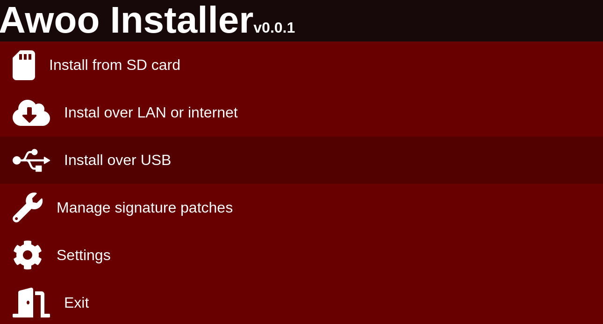

# Awoo Installer

A silly thing to learn electron differences quickly.

THIS IS NOT A REAL PROJECT, DON'T LOOK AT THIS SERIOUSLY

Based on 

I don't think I learned much about electron but it was nice thing to see how fast I can bring something to form. I actually spent like 45 minutes trying to get the footer in the image replicated but then I tossed it out cause computer doesn't make sense to have that.

Would like to put images more since the result so far looks like this

Had some issues setting up electron and trying to package it so would definitely try to fix those very early before getting into a project next time. This seems to be a constant issue with me...
